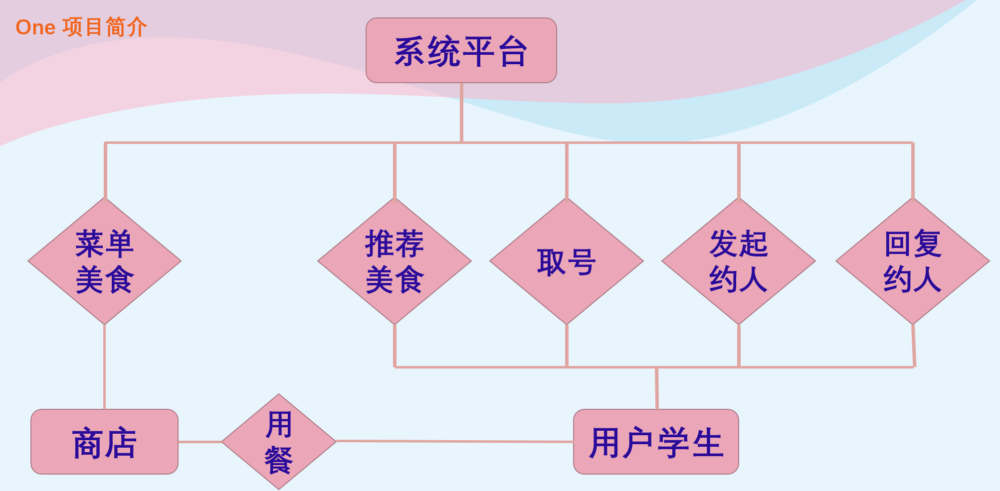
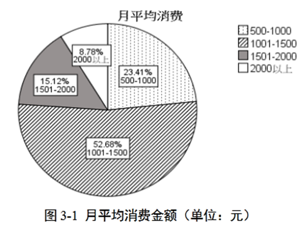
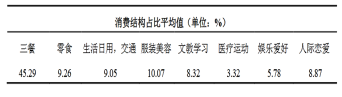
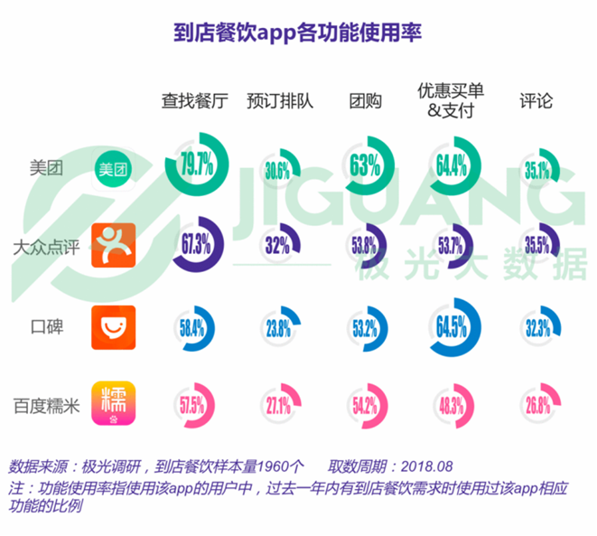
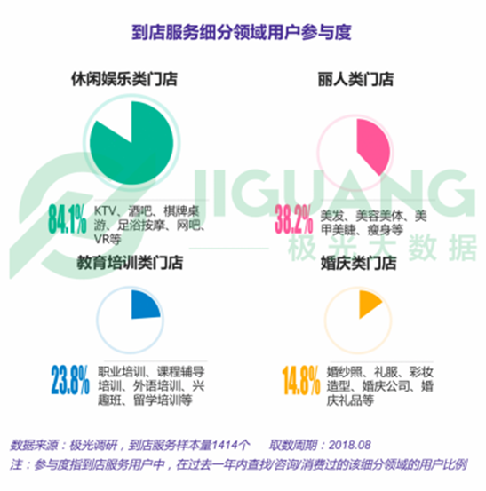
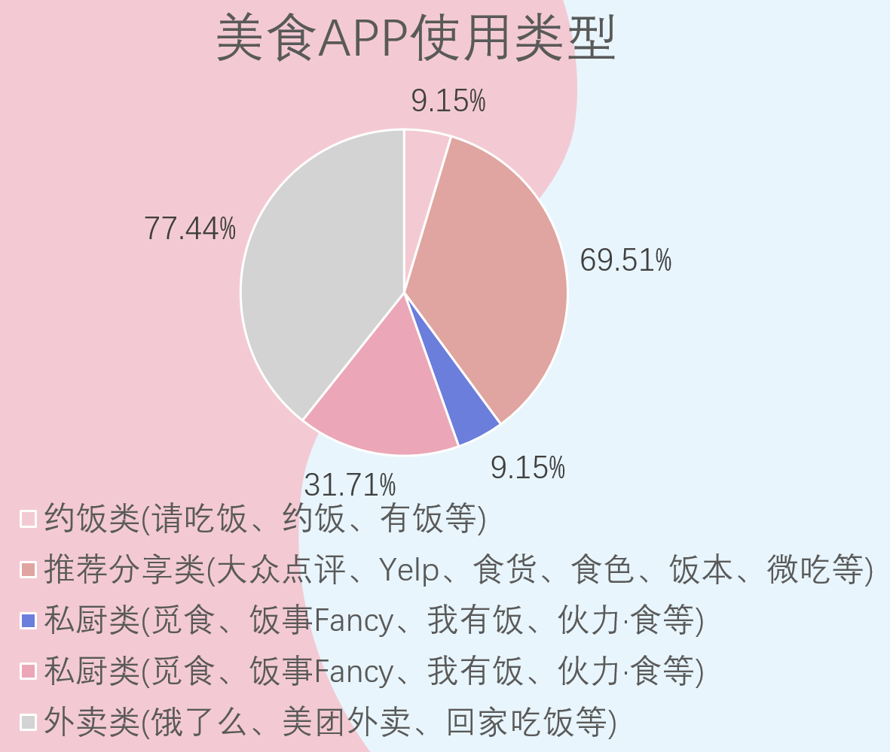
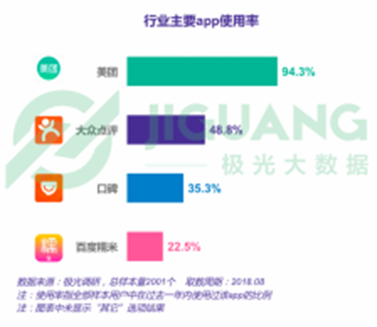

# 游学生

## 产生背景

1. 当代大学生在出游的时候总是找不到合适的游玩地方。
2. 当室友都找到了 npy 出去玩的时候，单身狗的假期应该和谁一起过？
3. 想玩大型多人项目总是凑不齐人，只能悻悻离去。
4. 怎样从网上一堆攻略中，辨别所谓的网红店的质量。
5. 经常出现到了饭店却发现要排号，在门口饥肠辘辘地等了两个钟头才吃上饭的情况。
6. 虽然下沙大学城有这么多学校，但是发现平时根本接触不到其他学校的xjj、xgg

## 项目简介

​		建立一个**平台**，能切实地解决大学生的*出行选择困难*，提供个性化的*出行建议*，匹配合适的*出行伙伴*，节省出行开支，合理规划时间，成为您贴心的专属出行顾问。

​		下图是平台系统的基础构成：

**目标用户**：在校大学生

**运作方法**：

   1. 与商店合作，让商店提供他们的介绍信息和实时客流量信息，可以的话也可以提供优惠。
      2. 平台工作人员现场考察，亲身体验，为用户提供优秀的出行路线。
      3. 对平台用户进行学生认证，认证成功的学生可以享受更具体、丰富、个性化的出行建议，同时也为认证成功的用户开启路线、商家、出行伙伴的评价系统
      4. 依据用户的个性化要求尽可能匹配到合适的同学一起出游。

**品牌推广**：

1. 线下推广：与商家商议实行优惠政策
2. 线上推广：建立各种百度词条（百度百科、搜搜百科等），在各大社交平台（如微博、微信、QQ）上推广
3. 前期作为一个免费的推荐类型的 APP 先打入市场，后期逐步和商家建立长期合作，获得更多出行资源

## 项目可行性

​		目前的市场上，没有和我们的项目一样，能够提供同城一条龙出行个性化建议服务的，也没有提供安全的出行伙伴的平台

​		而我们正可以补充这一空缺。

​		我们的**优势**在于：

1. 自己本身就是在校大学生，我们知道当代大学生喜欢去什么地方玩，也知道当代大学生对哪方面感兴趣，可以对商家和路线进行个性化分析和辨别
2. 通过收集周边同学的出行经验与平台工作人员的实地考察，我们可以提供一整天的出行路线，避免了同学们出行的时候发生上午逛完了想去的地方，下午不知道该去哪的尴尬情况
3. 为不同的出行情况（如情侣、基友、团建等）提供个性化的出行建议
4. 通过对学生的实名认证（拍照上传学生证等方式）尽量保证学生的出行安全
5. 对通过平台结伴出行的同学们进行定位获取，并提供一键报警服务，避免恶性事件发生

## 市场吸引力

### 市场定位		

如上述所说，现在的市场上没有与我们定位相同的平台：

1. 美团专注于 O2O 模式服务，没有完整的出行建议
2. 知乎匿名提问和回答减低了可信度
3. 大众点评刷评论的较多，网红打卡点不一定好
4. 交友 APP 没有学生实名认证，无法提供安全保障
5. 携程等旅游 APP 更侧重于旅游而非同城出行计划

### 大学生的消费水平

​		一线城市学生消费水平和消费结构图如下：

​		可以看出，大学生*生活费金额*普遍位于1500～2000元之间，并且*消费占比均值最高*的是三餐

​		并且，大学生的消费水平在未来几年内预计会逐渐增长，随着生活水平的逐渐提高，大学生的消费水平同时也逐渐提高，但总体消费水平浮动不大。

### 行业结构分析

<table>
    <tr>
        <td>

</td>
        <td>

</td>
    </tr>
</table>

美食 APP 使用类型如下：

大多数APP中定外卖、推荐分享是主要功能。根据调查问卷与APP数据统计可知，用户在美团等APP上使用功能最多的是查找餐厅、团购、买单等活动。

## 竞争对手

行业主要app使用率格局明朗：

- 美团使用率显著高于其它app，94.3%的行业用户使用过美团进行消费。
- 而且其它app间的使用率差距也十分明显，第二位的大众点评有近五成的使用率，而第二梯队的口碑和百度糯米为百分之二三十的使用率。

